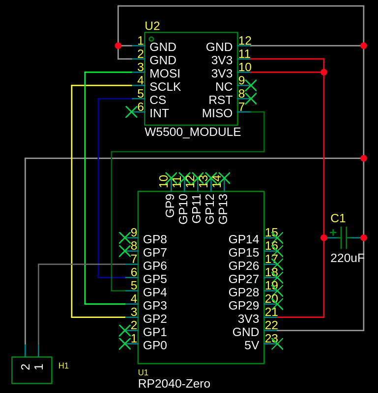
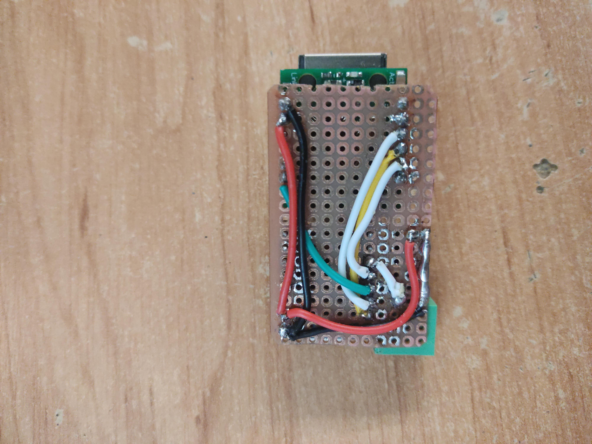
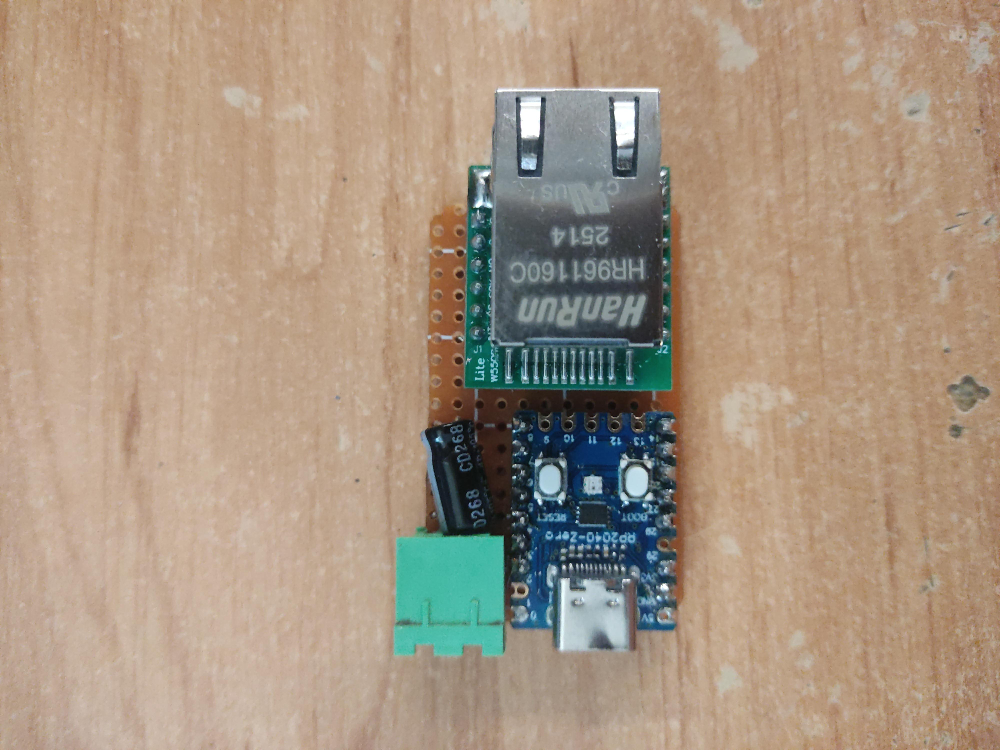
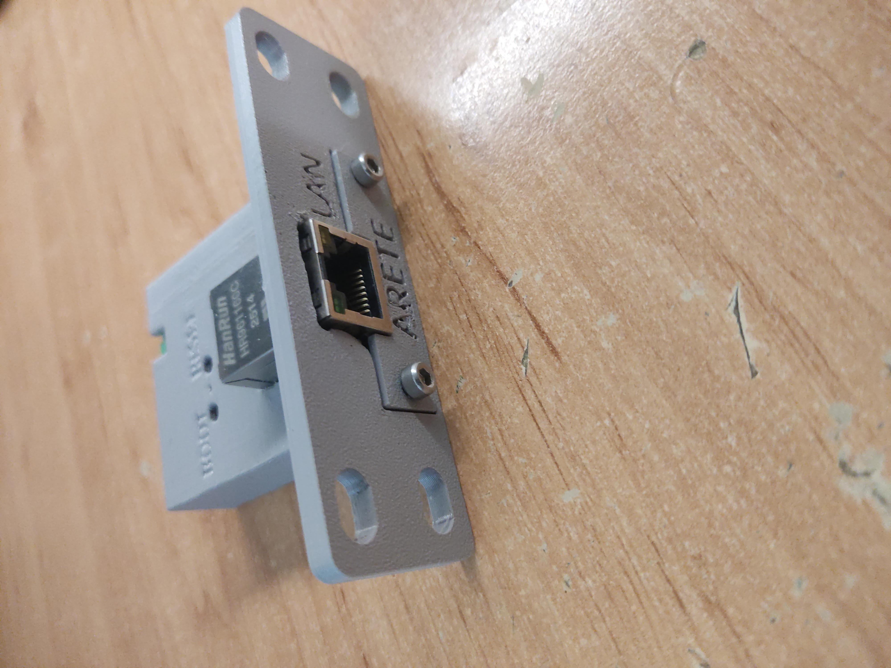

# RP2040-MicrotikAPI
This project is used to enable / disable firewall rule using RouterOS rest API

Project is based on RP2040-zero dev board and W5500 ethernet module

Powering via USB-C

✅	- tested
☑️ - it should work
❔ - not tested
❌ - not compatible
⌚ - in progress

| Board | Compatibility status |
|--|--|
| RP2040-zero + W5500 | ✅ |
| RP2350-zero + W5500 | ❌ ⌚ |
| W5500-EVB-Pico |❔ ☑️  |
| W5500-EVB-Pico-PoE | ✅ | 
| W55RP20-EVB-PICO | ❌ |
| W6300-EVB-Pico | ❌ |
| W6100-EVB-Pico | ❌ |
| W5100S-EVB-Pico | ❌ |
| W6300-EVB-Pico2| ❌ |
| W6100-EVB-Pico2| ❌ | 
| W5500-EVB-Pico2 |❔ ☑️ |
|W5100S-EVB-Pico2| ❌ |

## Building it
Here is schematic how to connect ethernet module with RP2040-zero
Sometimes it started happening that ethernet module can´t boot, it was happening most times with long USB cable. I fixed it by adding cappacitor to the 3.3V power line.

I builded it on pice of protoboard

## Enclousure
I 3D printed rackmount case for this project

## W5500-EVB-Pico
Code is compatible with W5500-EVB-Pico board. This board combine raspberry pi pico and W5500 ethernet module.
[W5500-EVB-PICO documentation](https://docs.wiznet.io/Product/iEthernet/W5500/w5500-evb-pico)

## RouterBoard configuration
**Supported versions > RouterOS v7.1beta4**
 - Login in to your router using WinBox
 - Optional: Create Group API in `system/groups` with policy `write, rest-api, read, api`
 - In `system/users` create user for accessing via API with api group created before
 - Optional reserve DHCP address for this device and add it under Allowed addresses
 - Make sure that in `IP/Services` WWW is enabled
 - Create firewall rule with some specific comment that we will be targeting ex:"GPIO controled port" 
	
Terminal
 - `user/group/add name=test policy=read, write, api, rest-api comment="Group for rest-api"`
 - `user/add name=api password=1234 group=api comment="User for rest-api"`
 - `ip/service/enable www`
 - `ip/firewall/nat/add comment="GPIO controled port"` ...

## Firmware

 - open MicrotikAPI/MicrotikAPI.ino in arduino ide
 - install Raspberry Pi Pico by earlephilhower using board manager
 - set target board as Waveshare RP2040 Zero or WIZnet W5500-EVB-Pico based on your board
 - install libraries
 - in file config.h
	- set `server[]` to RouterBoard IP
	- set `AUTH_USER` to user created in step 2.3
	- set `AUTH_PASSWD` to user password in step 2.3
	- set `targetVariableValue` to comment of targeted rule
 - Power On the device or push RESET while holding BOOT button
 - Compile and upload

[microtik rest-api doc](https://help.mikrotik.com/docs/spaces/ROS/pages/47579162/REST+API)

## V2 ideas
- use W5500-EVB-PICO
- web interface
- more gpio
- OTA
- stackable
- more apis

